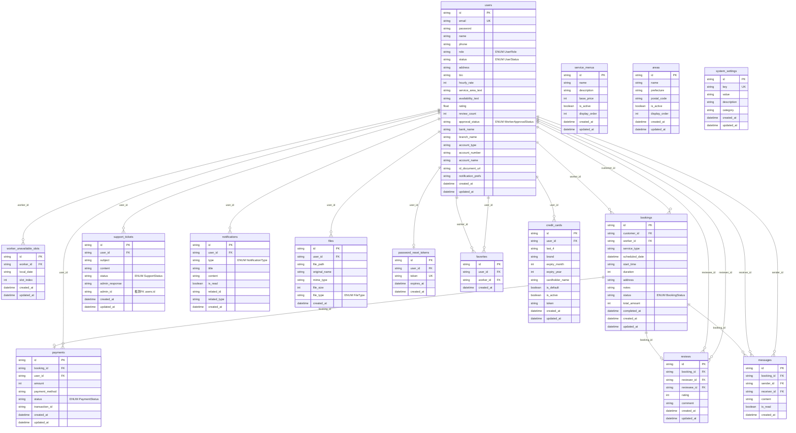

# ER 図（詳細版）

**保守・レビュー時は [relations.md](./relations.md) とセットで参照してください。**

同ファイルに、<strong>DB FK・Prisma リレーション・サービス層の include・論理参照（コード行根拠）</strong>を再洗いした結果を記載しています（Repository 層は存在せず `src/services/*.js` が Prisma を直接利用）。

Excel で簡易リレーションのみ確認する場合: **[er_diagram_for_excel.csv](./er_diagram_for_excel.csv)**（UTF-8 BOM）。

**検証対象**: `kajishift-backend/prisma/schema.prisma`、`prisma/migrations/**/*.sql`、`src/services/*.js`、`src/config/database.js`（生 SQL の JOIN はアプリ業務コードに **なし**）。

対象スキーマ: PostgreSQL `public` を想定。物理名は `@@map` / `@map` に準拠します。

## 記号・表記ルール

| 表記 | 意味 |
|---|---|
| `PK` | 主キー（`@id`） |
| `FK` | 外部キー（マイグレーションで `REFERENCES` が定義されている列） |
| `UK` | 一意制約（`@unique` または UNIQUE INDEX） |
| `ENUM(xxx)` | PostgreSQL の ENUM 型 `xxx`（値の一覧は `table_definition.md` 付録） |
| `datetime` | `timestamp(3)`（Prisma `DateTime`） |
| `string` | `text` / `varchar` 等の文字列。`jsonb`（`notification_prefs`）も Mermaid 都合で **`string`** と表記（実体は JSON）。 |
| `int` / `float` / `boolean` | 各 PostgreSQL 型に相当 |

**本 ER 図のリレーション線**は、原則として **`prisma/migrations` に存在する外部キー**のみです。  
`support_tickets.admin_id` → `users.id` は **DB 上 FK ではない**ため線は引いていません（列は「推測FK」として属性に注記）。  
`bookings.service_type` と `service_menus.name` の対応は **FK ではない**ため線は引かず、[論理関連（FK 以外）](#論理関連fk-以外) に記載します。

---

## Mermaid（erDiagram・全テーブル・主要属性）

図が長いため、**①エンティティ属性**と**②リレーション線**の 2 ブロックに分けています（同一 `erDiagram` 内で解釈されます）。

### 属性表記の補足

- `payments.booking_id` / `reviews.booking_id` / `password_reset_tokens.user_id` は **DB 上で外部キーかつ一意**（1 親に高々 1 子）です。Mermaid の属性行では修飾子 `UK` と `FK` を同時に付けられないため、図上は **`FK` のみ**表記し、一意は本文・`relations.md` で補足します。
- `notification_prefs` は PostgreSQL では **`jsonb`**。Mermaid の型表記の都合で図では `string` としています（実体は JSON）。
- `completed_at` は `schema.prisma` に存在しますが、**リポジトリ内マイグレーションとの差異**があり得ます（`questions.md`）。
- **履歴テーブル・ワークテーブル・監査ログ専用テーブル**は本スキーマには定義されていません（時系列は主に `created_at` / `updated_at` で表現）。

---

## 論理関連（FK 以外）

アプリまたは運用上の参照のみで、**DB の外部キー制約はない**関係です（線は引いていません）。

| 起点 | 列 | 参照先（推測・運用） | 備考 |
|---|---|---|---|
| bookings | service_type | `service_menus.name` と **文字列一致**で利用（削除ガード等） | **コード上の関連**。根拠: `adminService.js` `deleteServiceMenu` 内 `booking.count({ serviceType: service.name })`。 |
| users | service_area_text / availability_text | マスタ `areas` とは **FK なし**。ワーカー向けは JSON v1 形式または自由記述（`workerService.js`） | `areas` テーブルとは結合しない。 |
| users | address | ワーカー一覧の `area` クエリは **`users.address` の部分一致**（`areas.id` ではない） | **コード上の関連**。根拠: `workerService.js` `getWorkers`。 |
| notifications | related_id + related_type | ポリモーフィック（BOOKING / MESSAGE / PAYMENT / REVIEW 等） | **FK なし**。`questions.md` No.8–9。 |
| support_tickets | admin_id | `users.id`（管理者）想定で **認証 `adminId` を格納** | **コード上の関連**。Prisma リレーションなし。`questions.md` No.3。 |

---

## 図の読み方（リレーション線）

- `users` と `bookings` は **customer_id** と **worker_id** の 2 経路（いずれも `users.id`）。
- `favorites` は **user_id** と **worker_id** の 2 本が `users` を参照（中間テーブル的役割）。
- `bookings` → `payments` / `reviews` は **||--o|**（子は高々 1：`booking_id` UNIQUE）。
- `service_menus` / `areas` / `system_settings` は **他テーブルへの FK 線なし**（マスタ・設定として単独記載）。

---

## 補足（ENUM 型一覧）

PostgreSQL ENUM として定義: `UserRole`, `UserStatus`, `WorkerApprovalStatus`, `BookingStatus`, `PaymentStatus`, `SupportStatus`, `NotificationType`, `FileType`。  
値の一覧は **[table_definition.md](./table_definition.md)** の付録を参照してください。

**TEXT 列でアプリが許可リストを持つもの**（DB ENUM ではない）: `payments.payment_method`（`paymentService.js`）、`notifications.type`（DB は ENUM 型だがアプリでも配列検証あり—詳細は [relations.md](./relations.md) の「7. 区分値」）。
