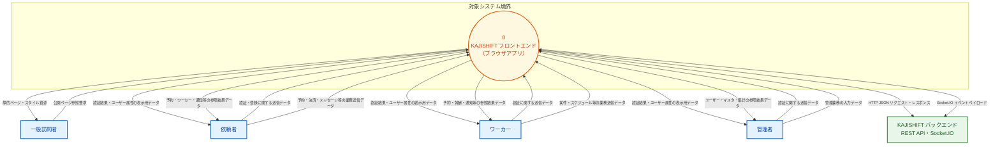
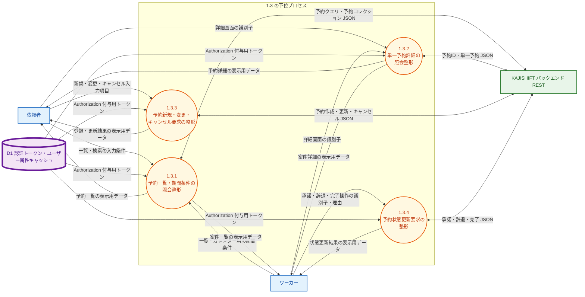
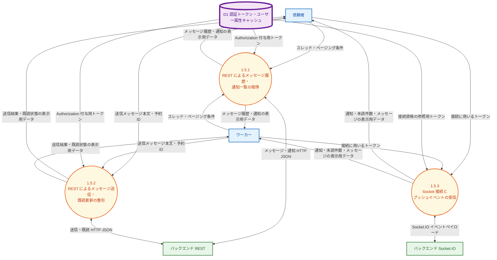
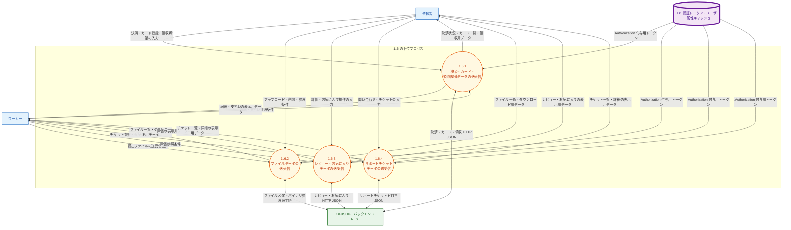
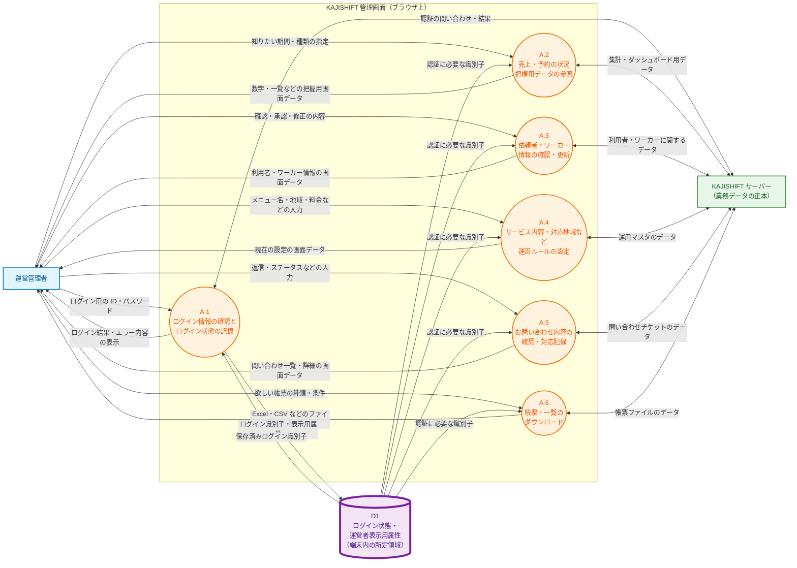

# KAJISHIFT フロントエンド — データフロー図（DFD・デマルコ式）

本ドキュメントはブラウザ上の KAJISHIFT フロントエンドを対象とした DFD です。Mermaid で記述しています。

## 記号（デマルコ式と Mermaid の対応）

| デマルコ式 | Mermaid での表現 |
|-----------|------------------|
| 源泉・吸収 | 角長方形 `[テキスト]`（青系スタイル） |
| プロセス | `((番号\n名称))`（橙系） |
| データストア | `[(名称)]` ＋太枠（紫系）※二重線の近似 |
| データフロー | 矢印＋`|ラベル|`（データ名のみ） |
| 外部システム | `BE[...]`（緑系） |

実行順序は表しません。プロセス番号は階層（0 → 1.x → 1.x.y）に対応します。

**目次**: レベル0（コンテキスト） → レベル1 → レベル2（1.3 / 1.5 / 1.6 / 1.7） → **顧客説明用（運営管理者）** → 実装対応・書き出し手順

---

## レベル0：コンテキスト図

---

## レベル1：フロントエンド分解図

```mermaid
%%{init: {"flowchart": {"htmlLabels": true}}}%%
flowchart TB
  classDef entity fill:#E3F2FD,stroke:#1565C0,stroke-width:2px,color:#0D47A1
  classDef process fill:#FFF8E1,stroke:#E65100,stroke-width:2px,color:#BF360C
  classDef datastore fill:#F3E5F5,stroke:#6A1B9A,stroke-width:5px,color:#4A148C
  classDef backend fill:#E8F5E9,stroke:#2E7D32,stroke-width:2px,color:#1B5E20
  classDef febox fill:#FFFDE7,stroke:#F9A825,stroke-width:1px,stroke-dasharray: 4 3

  subgraph users["源泉・吸収"]
    direction TB
    V[一般訪問者]
    C[依頼者]
    W[ワーカー]
    A[管理者]
  end
  class V,C,W,A entity

  subgraph FE["フロントエンド（対象システム）"]
    class FE febox
    direction TB
    subgraph row1[" "]
      direction LR
      P1((1.1\n認証トークン・ユーザー属性の\n取得とキャッシュ))
      P2((1.2\n静的・公開画面の配信))
      P3((1.3\n予約データの送受信))
    end
    subgraph row2[" "]
      direction LR
      P4((1.4\nワーカー・サービス・エリア等の\n検索送受信))
      P5((1.5\nメッセージ・通知の\n送受信))
      P6((1.6\n決済・ファイル・レビュー・\nお気に入りの送受信))
      P7((1.7\n管理者向けマスタ・\n集計データの送受信))
    end
  end
  class P1,P2,P3,P4,P5,P6,P7 process

  D1[(D1 認証トークン・ユーザー属性キャッシュ\nブラウザ localStorage)]
  class D1 datastore

  BE[KAJISHIFT バックエンド\nREST・Socket.IO]
  class BE backend

  V -->|"公開ページ参照要求"| P2
  P2 -->|"静的マークアップ・スタイル資源"| V

  C -->|"登録・ログイン入力データ"| P1
  C -->|"予約操作入力データ"| P3
  C -->|"ワーカー検索条件・選定入力"| P4
  C -->|"メッセージ送信内容"| P5
  C -->|"決済・カード・ファイル・レビュー入力"| P6
  P1 -->|"認証結果・エラー表示用データ"| C
  P3 -->|"予約一覧・詳細の表示用データ"| C
  P4 -->|"ワーカー・予約画面向け検索結果"| C
  P5 -->|"スレッド・通知の表示用データ"| C
  P6 -->|"決済・ファイル一覧の表示用データ"| C

  W -->|"登録・ログイン入力データ"| P1
  W -->|"案件・カレンダー・プロフィール操作入力"| P3
  W -->|"チャット送信内容"| P5
  W -->|"報酬・ファイル参照条件"| P6
  P1 -->|"認証結果・エラー表示用データ"| W
  P3 -->|"案件・予定の表示用データ"| W
  P5 -->|"メッセージ・通知の表示用データ"| W
  P6 -->|"報酬・ファイルの表示用データ"| W

  A -->|"管理者ログイン入力データ"| P1
  A -->|"ユーザー・ワーカー・チケット等の管理入力"| P7
  P1 -->|"認証結果・エラー表示用データ"| A
  P7 -->|"管理画面向け一覧・詳細・設定の表示用データ"| A

  P1 <-->|"認証系 HTTP リクエスト・レスポンス"| BE
  P3 <-->|"予約系 HTTP リクエスト・レスポンス"| BE
  P4 <-->|"ワーカー・レビュー・エリア等 HTTP リクエスト・レスポンス"| BE
  P5 <-->|"メッセージ・通知 HTTP リクエスト・レスポンス"| BE
  P5 <-->|"Socket.IO イベントペイロード"| BE
  P6 <-->|"決済・ファイル・お気に入り HTTP リクエスト・レスポンス"| BE
  P7 <-->|"管理・マスタ・レポート HTTP リクエスト・レスポンス"| BE

  P1 -->|"トークン文字列・ユーザー属性 JSON"| D1
  D1 -->|"保存済みトークン・ユーザー属性 JSON"| P1
  D1 -->|"Authorization 付与用トークン"| P3
  D1 -->|"Authorization 付与用トークン"| P4
  D1 -->|"Authorization 付与用トークン"| P5
  D1 -->|"Authorization 付与用トークン"| P6
  D1 -->|"Authorization 付与用トークン"| P7
```

**補足:** 実装では `ApiClient.request` がトークンを一括参照しますが、図では業務プロセスごとの論理参照として D1 から各プロセスへ矢印を引いています。

---

## レベル2：プロセス 1.3「予約データの送受信」の分解

---

## レベル2：プロセス 1.5「メッセージ・通知の送受信」の分解

---

## レベル2：プロセス 1.6「決済・ファイル・レビュー・お気に入りの送受信」の分解

依頼者・ワーカーがそれぞれの画面から扱う付帯業務を、API の責務に沿って分割しています。

---

## レベル2：プロセス 1.7「管理者向けマスタ・集計データの送受信」の分解

運営が管理画面から行う操作を、バックエンドの管理系 API に対応させて分割しています（7 プロセス以内）。

```mermaid
%%{init: {"flowchart": {"htmlLabels": true}}}%%
flowchart TB
  classDef entity fill:#E3F2FD,stroke:#1565C0,stroke-width:2px,color:#0D47A1
  classDef process fill:#FFF8E1,stroke:#E65100,stroke-width:2px,color:#BF360C
  classDef datastore fill:#F3E5F5,stroke:#6A1B9A,stroke-width:5px,color:#4A148C
  classDef backend fill:#E8F5E9,stroke:#2E7D32,stroke-width:2px,color:#1B5E20

  A[管理者]
  class A entity

  subgraph inner["1.7 の下位プロセス"]
    direction TB
    subgraph r1[" "]
      direction LR
      P71((1.7.1\n依頼者ユーザー\nデータの送受信))
      P72((1.7.2\nワーカー登録・\nアカウントの送受信))
      P73((1.7.3\n予約・売上・利用状況\nレポートの照会))
    end
    subgraph r2[" "]
      direction LR
      P74((1.7.4\nシステム設定\nデータの送受信))
      P75((1.7.5\nサービスメニュー・\n対応エリアの送受信))
      P76((1.7.6\nサポートチケット\n運用データの送受信))
      P77((1.7.7\n集計帳票ファイル\nの取得))
    end
  end
  class P71,P72,P73,P74,P75,P76,P77 process

  D1[(D1 認証トークン・ユーザー属性キャッシュ)]
  class D1 datastore
  BE[KAJISHIFT バックエンド REST]
  class BE backend

  A -->|"依頼者検索・更新・削除の入力"| P71
  A -->|"ワーカー検索・承認・更新の入力"| P72
  A -->|"レポート期間・種別の指定"| P73
  A -->|"システム設定の入力"| P74
  A -->|"メニュー・エリアの登録・変更入力"| P75
  A -->|"チケット対応・削除の入力"| P76
  A -->|"出力形式・条件の指定"| P77

  P71 -->|"依頼者一覧・詳細の表示用データ"| A
  P72 -->|"ワーカー一覧・詳細の表示用データ"| A
  P73 -->|"集計結果・ダッシュボード用データ"| A
  P74 -->|"現在の設定の表示用データ"| A
  P75 -->|"マスタ一覧の表示用データ"| A
  P76 -->|"チケット一覧・詳細の表示用データ"| A
  P77 -->|"CSV・Excel ファイルデータ"| A

  D1 -->|"Authorization 付与用トークン"| P71
  D1 -->|"Authorization 付与用トークン"| P72
  D1 -->|"Authorization 付与用トークン"| P73
  D1 -->|"Authorization 付与用トークン"| P74
  D1 -->|"Authorization 付与用トークン"| P75
  D1 -->|"Authorization 付与用トークン"| P76
  D1 -->|"Authorization 付与用トークン"| P77

  P71 <-->|"管理ユーザー HTTP JSON"| BE
  P72 <-->|"管理ワーカー HTTP JSON"| BE
  P73 <-->|"各種レポート HTTP JSON"| BE
  P74 <-->|"システム設定 HTTP JSON"| BE
  P75 <-->|"サービス・エリア HTTP JSON"| BE
  P76 <-->|"管理チケット HTTP JSON"| BE
  P77 <-->|"帳票バイナリ・ダウンロード応答"| BE
```

---

## 顧客説明用：運営管理者の操作とデータの流れ

**読み手**: システム概要を把握する依頼主・ステークホルダ向け。技術用語を減らし、運営側の業務イメージが伝わるようにしています。記号の意味は冒頭の対応表と同じです。

**補足**: 「ログイン状態の記憶」は、ブラウザの所定領域（図では D1）に、サーバーが発行した**ログイン識別子**と**画面表示に必要な運営者属性**を保存するイメージです。パスワードそのものをアプリが保存する図ではありません。

---

## 実装との対応（参照）

| 論理 | 主な実装 |
|------|-----------|
| D1 | `localStorage` の `token` / `user`、`js/api.js` の `ApiClient` |
| 1.1 | `register` / `login` / `getMe` / `clearToken` 等、`js/auth.js` |
| 1.5・Socket | `js/socket.js`、顧客の `dashboard.html` / `notifications.html` / `chat.html` |
| 1.6.1 | `getPayments` / `createPayment` / `processPayment` / `getCards` / `addCard` / `updateCard` / `deleteCard` / `downloadReceipt` |
| 1.6.2 | `uploadFile` / `getFiles` / `getFileById` / `downloadFile` / `deleteFile` |
| 1.6.3 | `createReview` / `getReviewsByWorkerId` / `getFavorites` / `addFavorite` / `removeFavorite` / `checkFavorite` |
| 1.6.4 | `getSupportTickets` / `createSupportTicket` / `getSupportTicketById`（依頼者・ワーカー向け） |
| 1.7.1 | `getAdminUsers` / `updateUser` / `deleteUser` / `registerAdmin` |
| 1.7.2 | `getAdminWorkers` / `approveWorker` / `updateWorker` / `deleteWorker` |
| 1.7.3 | `getAdminBookingReport` / `getAdminRevenueReport` / `getAdminUserReport` / `getAdminWorkerReport` |
| 1.7.4 | `getSystemSettings` / `updateSystemSettings` |
| 1.7.5 | `getServiceMenus` / `createServiceMenu` / `updateServiceMenu` / `deleteServiceMenu` / `getAreas` / `createArea` / `updateArea` / `deleteArea` |
| 1.7.6 | `getSupportTickets` / `getSupportTicketById` / `updateSupportTicket` / `deleteSupportTicket` |
| 1.7.7 | `downloadCSV` / `downloadExcel` |
| 顧客説明用 A.1〜A.6 | 上記 1.1・1.7 系と D1 を、運営業務の言葉で要約したビュー（`admin/*.html` 一式） |
| 環境 URL | `js/config.js` の `API_BASE_URL` / `SOCKET_SERVER_URL` |

---

## PNG / SVG で書き出す場合

1. [Mermaid Live Editor](https://mermaid.live) を開く。
2. 各コードブロックの **中身**（`flowchart` から最後の行まで）だけをコピーして貼り付ける。
3. **Actions** から PNG または SVG をダウンロードする。

または `@mermaid-js/mermaid-cli` の `mmdc` で `.mmd` ファイルから一括変換できます。
